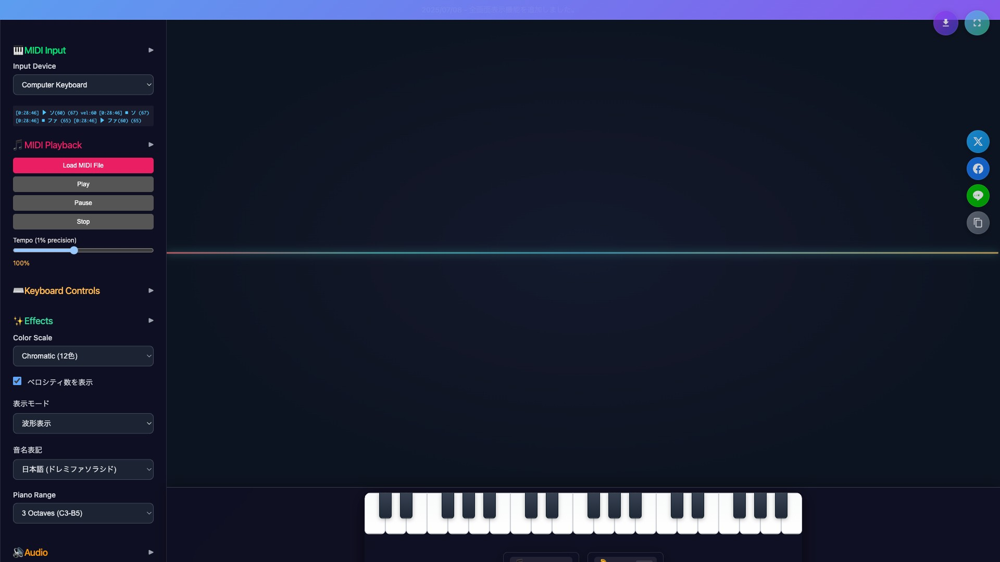

# Piano Visualizer / ピアノビジュアライザー

[](https://microgravity.github.io/piano-visualiser/)
[](LICENSE)
[](app.js)
[](https://threejs.org/)

美しい3Dビジュアライゼーションと高品質オーディオ合成を備えた、リアルタイムMIDI対応のインタラクティブピアノツール

An interactive 3D piano visualization tool with beautiful graphics, high-quality audio synthesis, and real-time MIDI support.



## 🚀 ライブデモ / Live Demo

**[https://microgravity.github.io/piano-visualiser/](https://microgravity.github.io/piano-visualiser/)**

## ✨ 最新の改善 / Latest Improvements

### v1.1.0 の新機能 / New in v1.1.0

- 🎨 **美しい背景画像** - SVGグラデーションで動的生成される3種類の背景パターン
- 🎯 **最適化されたフォントサイズ** - PCキーボード入力時の読みやすいサイズ調整  
- 📱 **折りたたみ可能サイドバー** - すべてのセクションでスムーズなアニメーション
- ⚖️ **バランス調整** - ベロシティ60での統一された表示サイズ
- 🔧 **安定性向上** - 初期化順序の最適化とエラーハンドリング強化

### New in v1.1.0

- 🎨 **Beautiful Background Images** - 3 types of dynamic SVG gradient patterns
- 🎯 **Optimized Font Sizes** - Readable sizing for PC keyboard input
- 📱 **Collapsible Sidebar** - Smooth animations for all sections  
- ⚖️ **Balanced Display** - Unified sizing with velocity 60
- 🔧 **Enhanced Stability** - Optimized initialization and error handling

## Features / 機能

### 🎹 MIDI Support / MIDI サポート

- **Real-time MIDI input** - Connect any MIDI device and play in real-time
- **Auto-detection of 88-key devices** - Automatically switches to full piano range
- **Sustain pedal support** - CC64 sustain pedal functionality
- **Computer keyboard input** - Play using your computer keyboard as fallback

- **リアルタイム MIDI 入力** - 任意の MIDI デバイスを接続してリアルタイム演奏
- **88 鍵デバイスの自動検出** - フルピアノ範囲への自動切り替え
- **サスティンペダル対応** - CC64 サスティンペダル機能
- **コンピューターキーボード入力** - フォールバックとしてコンピューターキーボードで演奏

### 🎵 Audio Engine / オーディオエンジン

- **Multiple timbres** - Acoustic piano, electric piano, harpsichord, organ, strings, vibraphone, music box, synthesizer, bell, flute
- **Velocity-sensitive synthesis** - Dynamic volume and tone based on playing strength
- **Sustain pedal effects** - Natural note sustaining with pedal control
- **Volume control** - Global volume adjustment with mute functionality

- **複数の音色** - アコースティックピアノ、エレクトリックピアノ、ハープシコード、オルガン、ストリングス、ビブラフォン、オルゴール、シンセサイザー、ベル、フルート
- **ベロシティ感応合成** - 演奏の強さに基づく動的な音量と音色
- **サスティンペダルエフェクト** - ペダルコントロールによる自然な音の持続
- **音量制御** - ミュート機能付きグローバル音量調整

### 🎨 Visual Effects / ビジュアルエフェクト

- **3D note visualization** - Notes float upward with smooth animations
- **Customizable colors** - Multiple color scales or custom color picker
- **Font customization** - Japanese (ドレミ) or Western (CDEFG) note names
- **Velocity display** - Optional velocity numbers with smaller font
- **Octave numbers** - Optional octave number display
- **Glow effects** - Customizable intensity and motion blur

- **3D 音符ビジュアライゼーション** - スムーズなアニメーションで音符が上昇
- **カスタマイズ可能な色** - 複数のカラースケールまたはカスタムカラーピッカー
- **フォントカスタマイゼーション** - 日本語（ドレミ）または西洋式（CDEFG）音名
- **ベロシティ表示** - 小さなフォントでオプションのベロシティ数値
- **オクターブ番号** - オプションのオクターブ番号表示
- **グローエフェクト** - カスタマイズ可能な強度とモーションブラー

### 📹 Screen Recording / 画面録画

- **Built-in screen recording** - Record your performances directly in the browser
- **iPhone-compatible MP4** - H.264 codec for maximum compatibility
- **Permission management** - User consent for screen recording access
- **Multiple codec support** - Automatic fallback for different browsers

- **内蔵画面録画** - ブラウザで直接演奏を録画
- **iPhone 対応 MP4** - 最大互換性のための H.264 コーデック
- **権限管理** - 画面録画アクセスのユーザー同意
- **複数コーデック対応** - 異なるブラウザでの自動フォールバック

## Installation / インストール

### Prerequisites / 前提条件

- Modern web browser with WebGL support
- MIDI device (optional - can use computer keyboard)
- WebGL 対応の最新ブラウザ
- MIDI デバイス（オプション - コンピューターキーボード使用可）

### Setup / セットアップ

1. **Clone the repository / リポジトリをクローン**

   ```bash
   git clone https://github.com/microgravity/piano-visualiser.git
   cd piano-visualiser
   ```

2. **Serve the files / ファイルを配信**

   ```bash
   # Using Python / Pythonを使用
   python -m http.server 8000

   # Using Node.js / Node.jsを使用
   npx serve .

   # Using any other web server / その他のWebサーバーを使用
   ```

3. **Open in browser / ブラウザで開く**
   ```
   http://localhost:8000
   ```

## Usage / 使用方法

### Basic Operation / 基本操作

1. **Connect MIDI device / MIDI デバイスを接続**

   - Connect your MIDI keyboard or controller
   - The app will auto-detect and suggest the best device
   - MIDI キーボードまたはコントローラーを接続
   - アプリが自動検出し、最適なデバイスを提案します

2. **Play music / 音楽を演奏**

   - Play notes on your MIDI device
   - Or use computer keyboard (Q-P keys for white keys, 2-0 for black keys)
   - MIDI デバイスで音符を演奏
   - またはコンピューターキーボードを使用（白鍵は Q-P キー、黒鍵は 2-0 キー）

3. **Customize appearance / 外観をカスタマイズ**
   - Adjust colors, effects, and display options in the control panel
   - コントロールパネルで色、エフェクト、表示オプションを調整

### Controls / コントロール

#### Visual Settings / ビジュアル設定

- **Animation Speed** - Control note movement speed / 音符の移動速度を制御
- **Size Multiplier** - Adjust note size / 音符のサイズを調整
- **Velocity Sensitivity** - How much velocity affects size / ベロシティがサイズに与える影響
- **Fade Duration** - How long notes remain visible / 音符が表示される時間
- **Glow Intensity** - Brightness of glow effects / グローエフェクトの明るさ

#### Color Settings / 色設定

- **Color Scale** - Choose from musical scales or custom colors / 音楽スケールまたはカスタム色から選択
- **Base Color** - Set custom base color / カスタムベース色を設定
- **Color Code Input** - Enter hex color codes directly / 16 進カラーコードを直接入力

#### Display Options / 表示オプション

- **Show Velocity Numbers** - Display velocity values like "ファ(127)" / "ファ(127)"のようにベロシティ値を表示
- **Show Octave Numbers** - Display octave numbers / オクターブ番号を表示
- **Note Name Style** - Japanese (ドレミ) or Western (CDEFG) / 日本語（ドレミ）または西洋式（CDEFG）

#### Audio Settings / オーディオ設定

- **Audio Timbre** - Select instrument sound / 楽器音を選択
- **Volume** - Global volume control / グローバル音量制御
- **Mute** - Disable audio output / オーディオ出力を無効化

### Keyboard Mapping / キーボードマッピング

**PCキーボード入力はベロシティ60で統一** / **PC keyboard input unified at velocity 60**

| Computer Key / コンピューターキー | Piano Note / ピアノ音 | Japanese / 日本語 | MIDI Note |
| --------------------------------- | --------------------- | ----------------- | --------- |
| A                                 | C4                    | ド4               | 60        |
| W                                 | C#4                   | ド#4              | 61        |
| S                                 | D4                    | レ4               | 62        |
| E                                 | D#4                   | レ#4              | 63        |
| D                                 | E4                    | ミ4               | 64        |
| F                                 | F4                    | ファ4             | 65        |
| T                                 | F#4                   | ファ#4            | 66        |
| G                                 | G4                    | ソ4               | 67        |
| Y                                 | G#4                   | ソ#4              | 68        |
| H                                 | A4                    | ラ4               | 69        |
| U                                 | A#4                   | ラ#4              | 70        |
| J                                 | B4                    | シ4               | 71        |
| K                                 | C5                    | ド5               | 72        |

## Technical Details / 技術詳細

### Architecture / アーキテクチャ

- **Frontend**: Pure HTML5, CSS3, and JavaScript (ES6+)
- **3D Graphics**: Three.js for WebGL rendering with dynamic background images
- **Audio**: Web Audio API for real-time synthesis
- **MIDI**: Web MIDI API for device communication
- **Background**: Dynamic SVG gradient generation with data URLs
- **Storage**: LocalStorage for settings persistence

- **フロントエンド**: 純粋な HTML5、CSS3、JavaScript（ES6+）
- **3D グラフィックス**: 動的背景画像対応のWebGLレンダリング用Three.js
- **オーディオ**: リアルタイム合成用 Web Audio API
- **MIDI**: デバイス通信用 Web MIDI API
- **背景**: data URLによる動的SVGグラデーション生成
- **ストレージ**: 設定永続化用LocalStorage

### New Technical Features / 新技術機能

- **🎨 Dynamic Background System** - 3 beautiful SVG patterns (piano keys, music waves, gradients)
- **📐 Responsive Canvas Sizing** - Background adapts to any screen size with mathematical precision
- **🔄 Collapsible UI Components** - Smooth CSS transitions with cubic-bezier easing
- **⚡ Optimized Initialization** - Fixed loading order prevents null reference errors
- **💾 Cross-platform Compatibility** - Data URLs replace CORS-blocked external resources

### 新技術機能

- **🎨 動的背景システム** - 3種類の美しいSVGパターン（ピアノキー、音楽波形、グラデーション）
- **📐 レスポンシブキャンバスサイズ** - 数学的精度で任意の画面サイズに背景が適応
- **🔄 折りたたみ可能UIコンポーネント** - cubic-bezierイージングによるスムーズなCSSトランジション
- **⚡ 最適化された初期化** - 読み込み順序修正によりnull参照エラーを防止
- **💾 クロスプラットフォーム互換性** - data URLによりCORSブロックされた外部リソースを代替

### Browser Compatibility / ブラウザ互換性

- Chrome 66+ (recommended / 推奨)
- Firefox 63+
- Safari 14.1+
- Edge 79+

### Performance / パフォーマンス

- **Optimized rendering** - Efficient sprite management and cleanup
- **Low latency audio** - Direct Web Audio API synthesis
- **Responsive design** - Adapts to different screen sizes
- **Memory management** - Automatic cleanup of old notes

- **最適化されたレンダリング** - 効率的なスプライト管理とクリーンアップ
- **低遅延オーディオ** - 直接 Web Audio API 合成
- **レスポンシブデザイン** - 異なる画面サイズに適応
- **メモリ管理** - 古い音符の自動クリーンアップ

## Development / 開発

### File Structure / ファイル構造

```
piano-visualiser/
├── index.html          # Main HTML file / メインHTMLファイル
├── app.js              # Core application logic / コアアプリケーションロジック
├── styles.css          # CSS styles / CSSスタイル
├── README.md           # This file / このファイル
└── screenshot.png      # Screenshot for README / README用スクリーンショット
```

### Key Classes and Functions / 主要なクラスと関数

#### PianoVisualizer Class / PianoVisualizer クラス

- `initThreeJS()` - Initialize 3D scene / 3D シーンを初期化
- `initMIDI()` - Setup MIDI input handling / MIDI 入力処理をセットアップ
- `initAudio()` - Configure Web Audio API / Web Audio API を設定
- `handleMIDIMessage()` - Process incoming MIDI data / 受信 MIDI データを処理
- `visualizeNoteThreeJS()` - Create 3D note sprites / 3D 音符スプライトを作成
- `synthesizeNote()` - Generate audio synthesis / オーディオ合成を生成

### Contributing / 貢献

1. Fork the repository / リポジトリをフォーク
2. Create a feature branch / 機能ブランチを作成
3. Make your changes / 変更を加える
4. Test thoroughly / 徹底的にテスト
5. Submit a pull request / プルリクエストを送信

### Coding Standards / コーディング規約

- Use ES6+ features where supported / サポート対象の ES6+機能を使用
- Follow consistent indentation (4 spaces) / 一貫したインデント（4 スペース）に従う
- Add comments for complex logic / 複雑なロジックにコメントを追加
- Test across multiple browsers / 複数のブラウザでテスト

## Troubleshooting / トラブルシューティング

### Common Issues / よくある問題

#### MIDI Device Not Detected / MIDI デバイスが検出されない

- Ensure device is connected before opening the app / アプリを開く前にデバイスが接続されていることを確認
- Check browser permissions for MIDI access / MIDI アクセスのブラウザ権限を確認
- Try refreshing the page / ページを再読み込みしてみる

#### Audio Not Playing / オーディオが再生されない

- Click anywhere on the page to activate audio context / オーディオコンテキストを有効にするためにページ上のどこかをクリック
- Check that audio is not muted / オーディオがミュートされていないことを確認
- Verify browser audio permissions / ブラウザのオーディオ権限を確認

#### Performance Issues / パフォーマンスの問題

- Reduce particle count in settings / 設定でパーティクル数を減らす
- Lower animation speed / アニメーション速度を下げる
- Close other browser tabs / 他のブラウザタブを閉じる
- Use a desktop browser instead of mobile / モバイルではなくデスクトップブラウザを使用

#### Recording Issues / 録画の問題

- Grant screen recording permissions when prompted / プロンプトが表示されたら画面録画権限を許可
- Use Chrome for best recording compatibility / 最適な録画互換性のために Chrome を使用
- Check available disk space / 利用可能なディスク容量を確認

## License / ライセンス

This project is licensed under the MIT License. See the LICENSE file for details.

このプロジェクトは MIT ライセンスの下でライセンスされています。詳細は LICENSE ファイルを参照してください。

## Acknowledgments / 謝辞

- Three.js for 3D rendering capabilities / 3D レンダリング機能の Three.js
- Web MIDI API for real-time MIDI support / リアルタイム MIDI サポートの Web MIDI API
- Web Audio API for audio synthesis / オーディオ合成の Web Audio API
- All contributors and beta testers / すべての貢献者とベータテスター

## Version History / バージョン履歴

### v1.1.0 (Latest / 最新) - December 2024

#### ✨ New Features / 新機能
- **Dynamic SVG Background System** - 3 beautiful auto-generated patterns
- **Collapsible Sidebar Sections** - All sections now fold/expand with smooth animations
- **Optimized PC Keyboard Input** - Unified velocity 60 for consistent display
- **Enhanced Font Sizing** - Better readability across all input methods

#### 🔧 Technical Improvements / 技術改善
- **CORS-Free Background Loading** - Data URLs replace external image sources
- **Fixed Initialization Order** - Prevents camera null reference errors
- **Improved Error Handling** - Robust fallbacks for all image loading
- **Canvas Auto-Sizing** - Background adapts perfectly to any screen size

#### 🎨 UI/UX Enhancements / UI/UX改善
- **Smoother Animations** - Cubic-bezier transitions for professional feel
- **Balanced Text Sizing** - PC keyboard input uses appropriate font sizes
- **Tighter Line Spacing** - Improved readability for velocity+note display
- **Japanese Commit Messages** - Consistent localization throughout

### v1.0.0 - November 2024

- Initial release with full MIDI and audio support / MIDI・オーディオ完全サポートの初回リリース
- 3D visualization with customizable effects / カスタマイズ可能なエフェクト付き 3D ビジュアライゼーション
- Screen recording functionality / 画面録画機能
- Multi-language support (Japanese/English) / 多言語サポート（日本語/英語）

---

**Created with ❤️ for music visualization / 音楽ビジュアライゼーションへの愛を込めて作成**
